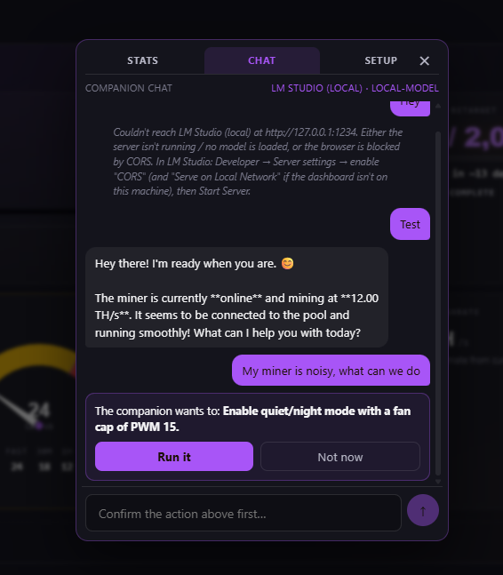
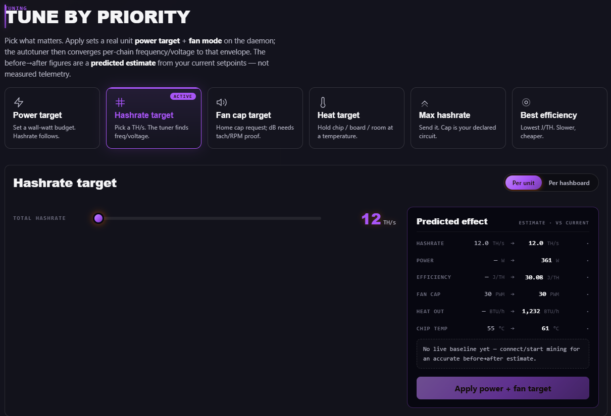

<div align="center">

# DCENT_OS — Open-Source Bitcoin Mining Firmware for Select Antminer and Bitaxe-Class Targets

**Turn an industrial or desktop Bitcoin ASIC into a quiet, efficient home mining space heater.**
Rust firmware · Buildroot Linux and ESP32-S3 targets · local web dashboard · zero mandatory dev fee · GPL-3.0.

Built by the Mining Hackers at **[D-Central Technologies](https://d-central.tech/)** — Canada's
leading Bitcoin mining technology company since 2016.

[Website](https://d-central.tech/dcent-os/) ·
[Quick start](#-quick-start) ·
[Platforms](#-supported-hardware) ·
[How it compares](#-how-it-compares) ·
[FAQ](#-faq) ·
[Governance](GOVERNANCE.md)


[](https://d-central.tech/fund/go?source=dcent_os&placement=release_notes)

_D-Central gives this away under GPL-3.0. If it helps you, [keep it alive](https://d-central.tech/fund/) — in Bitcoin or by card. Not a licence; commercial use is always free._

</div>

---

Built by the **Mining Hackers** at [D-Central Technologies](https://d-central.tech/) — Canada's leading
Bitcoin mining technology company since 2016, based in Laval, Québec. 2,500+ miners repaired,
400+ products shipped. This is the bench we use ourselves, released so every operator can own, repair,
and understand their own hardware.

---

## What is DCENT_OS?

**DCENT_OS** is D-Central's original, open-source firmware family for two Bitcoin-mining hardware
classes: selected industrial Bitmain Antminers and ESP32-S3 Bitaxe-class miners, with exact model
readiness shown in the matrix below. On
Antminer it replaces the stock firmware with a modern **Rust mining daemon (`dcentrald`)**, a
**Buildroot Linux** image, and a **local-first web dashboard**. On ESP devices, the `dcentaxe`
Rust workspace is the DCENT_OS-for-ESP member; see [`docs/ESP_DEVICES.md`](docs/ESP_DEVICES.md).

> **Readiness boundary (2026-06-26):** DCENT_OS is one firmware family, but
> public production install readiness is not claimed for every model in the
> S9-to-S21 and Bitaxe-class range. Antminer rows below separate mining/lab
> evidence from public-install readiness; the Xilinx public beta gate is still
> waiting on public artifact verification and witnessed live-install capstone
> evidence. ESP rows are DCENT_OS-for-ESP driver/build targets with Gamma
> live verification and legacy BM1370 lab context called out explicitly. Use DCENT Toolbox route dry-runs and
> per-platform install notes before any live write.

If you have a used S9, S17, S19, S21, or a Bitaxe-class desk miner in a closet, a basement, or a
workshop and you want it to run **quiet, efficient, fully under your control, and as a real space
heater** — this is the firmware family built for you, by a company that has done **thousands of
repairs** and shipped **hundreds of different products** doing exactly that.

It is the result of years of work — accelerating hard over the last six months — across hardware
captures, reverse engineering, on-bench validation of the Antminer fleet, and host/live validation of
the ESP32 Bitaxe-class tier. It is **open source under GPL-3.0**: compile it, study it, audit it, fork
it, build on it.

> **New here?** Start with the [Quick start](#-quick-start), then read
> [`docs/PLATFORMS.md`](docs/PLATFORMS.md) for your exact miner.

---

## Why DCENT_OS exists

Stock Antminer firmware and the major aftermarket firmwares are built for people who run hundreds
of miners in a warehouse. For **home miners**, they all fall short in the same ways — and DCENT_OS
fixes each one:

| The home-miner problem | DCENT_OS |
| --- | --- |
| **Mandatory dev fees** — 1.5–2.8% of your hashrate skimmed forever, no opt-out | **No mandatory fee.** A small, fully-visible, fully-disableable voluntary donation. Zero is valid. |
| **Loud by default** — fans pinned at 100% from boot | **Quiet by design.** Low-PWM boot, PID thermal control, and a policy that cuts hash before raising noise. |
| **PSU whitelists** — refuses unrecognized or "non-smart" PSUs | **PSU bypass.** No Loki board or smart-PSU requirement on proven lanes; PSU paths stay per-platform/live-gated. |
| **Closed firmware** — no source, no audit trail, no way to fix a bug | **Open source (GPL-3.0).** Read every line, build it yourself, fork it. |
| **One firmware per chip** — locked to a single board generation | **Universal hash boards.** One firmware, five chip families, ChipID auto-detection. Mix generations on one control board. |
| **Vendor lock-in** — the vendor goes dark, your upgrade path goes dark | **Yours forever.** Original open code, no license server, no phone-home, no remote backdoor. |

DCENT_OS is **original code** — a clean rewrite, not a fork of BraiinsOS or VNish. It is informed
by public reverse-engineering work (BraiinsOS, ESP-Miner, Mujina), but every line of `dcentrald`
is D-Central's own, under GPL-3.0.

---

## ✨ Key features

- **Auto-tuner** — per-chain frequency/voltage curves found at runtime, with hard voltage and
  fan-safety clamps. Efficiency-first (J/TH) by default.
- **Universal hash-board compatibility** — ChipID auto-detection across **BM1387, BM1397, BM1398,
  BM1362, BM1368/BM1366**. The validated/lab path can use an inexpensive S9 control board to
  drive supported later-generation hash boards while DCENT_OS loads the right driver. This is a
  compatibility capability, not a blanket production-install promise for every board mix.
- **PSU bypass & 120 V home mining** — three modes (Bypass / Auto-Detect / PMBus Monitor). No
  whitelist or Loki board on supported lanes; Amlogic/BB bypass remains live-soak gated.
- **Quiet home mining** — low-PWM fan boot, PID thermal control, real physical RPM reporting, and
  a **BTU/h** heat-output readout in every dashboard mode.
- **Stratum V1 today, Stratum V2 under gate** — BIP 320 version rolling, ASICBoost-aware share
  validation, nonce dedup, and default-off SV2/SmartSwitch surfaces while submit/accept and live
  failover soak remain open.
- **A/B sysupgrade OTA** — inactive-slot writes, atomic U-Boot env flip, and signed update bundles.
  Failed-boot recovery is platform/runbook-gated; keep a serial or SD recovery path.
- **Three-mode dashboard** — Space Heater / Mining / Hacker, local-first (no cloud, no telemetry,
  no Google Fonts, no CDN calls).
- **Safety-first firmware** — EEPROM write-protection at the hardware-abstraction layer, thermal
  supervision with graded throttling, and a teardown that cuts hash power before fan noise.
- **Open APIs** — REST + WebSocket, plus a CGMiner-compatible API on port 4028, so `pyasic` and
  the rest of the ecosystem work out of the box.
- **Donation, not dev fee** — voluntary, transparent, and always visible on the dashboard when
  active. Routes to **DCENT_Pool**, D-Central's [Solo/Guild pool](#-dcent_pool--the-sologuild-pool).

---

## 🖥️ The dashboard

DCENT_OS ships a local React/TypeScript dashboard served straight off the miner — **no account, no
cloud, no phone-home.** It has three skins for three kinds of operator:

- **🔥 Space Heater** — quiet-first, BTU/h headline, thermostat-style control. For "I want a warm
  room that happens to earn sats."
- **⛏️ Mining** — hashrate-first, classic miner UX, efficiency and pool telemetry front and center.
- **💻 Hacker** — every register, every probe, every diagnostic surfaced. For people who want to
  see the FPGA.

### 🐾 Your companion — chat with your miner

Every dashboard has a companion you can **talk to**. Connect your own LLM — a **local** model via
[Ollama](https://ollama.com) or [LM Studio](https://lmstudio.ai) (recommended; nothing leaves your
network) or a cloud provider — and just ask. *"My miner is noisy, what can we do?"* → it reads the
live state and offers to act, with your confirmation. Off by default, local-first, and your API key
never leaves the browser.



### 🎚️ Honest tuning — "Tune by Priority"

Tell DCENT_OS what matters — a wall-watt budget, a hashrate target, a fan-noise cap, a heat target,
max hashrate, or best efficiency — and the autotuner converges per-chain frequency/voltage to that
envelope. Every before→after number is labelled a **predicted estimate from your setpoints, not
measured telemetry** — DCENT_OS never shows you a number it didn't actually measure.



> 📸 More screenshots and a live walkthrough GIF are in [`docs/media/`](docs/media/).

---

## 🤖 A built-in MCP server — your miner is AI-controllable

Your miner speaks **MCP** — the [Model Context Protocol](https://modelcontextprotocol.io) that AI
agents use to discover and call tools. `dcentrald` exposes an MCP endpoint right on the box, so any
agent on your network can **read** the miner and — with your permission — **run** it:

- **Read** — live hashrate, per-chip temperatures, fan RPM, pool and share state, system health, even
  raw FPGA registers and PIC status.
- **Act** — switch pools, restart mining, set fan speed, run diagnostics, change config, and trigger
  the identify LED. On a release image every control tool requires an authenticated owner session
  (read stays open).

Point your agent at it — **Claude Code, Codex, Hermes, OpenClaw, NanoClaw**, or anything that speaks
MCP — and it can operate a miner the way you would, just faster and around the clock.

**You stay in control.** On a release image, reads are open but every write/control tool is
**bearer-token gated and fails closed** — no token, no actions. You decide exactly what an agent may
touch, and you can revoke it at any time.

### Why this matters

This is the missing link between **AI** and **proof-of-work**. With a miner that's natively
agent-controllable, an agent can watch J/TH, room temperature, electricity prices, and the mempool
and **tune your hashrate continuously** — AI-optimized mining instead of a static config. And it
points at something bigger: **agents that own and operate their own miners** — earning, spending, and
securing real bitcoin without a human in the loop.

D-Central shipped one of the first Bitcoin-mining MCP servers because that future isn't a someday.
**The future is now** — and it's open source.

---

## ☀️ Off-grid ready — solar, battery, direct-to-DC

A Bitcoin miner is the most flexible electrical load on earth: it can throttle in seconds and run on
whatever power you have. DCENT_OS leans all the way into that — the off-grid and renewable tooling is
**built in and open**, not a paid add-on:

- **Solar-aware mining** — connect your solar production (provider integrations + a guided setup) and
  mine the surplus; the built-in **power-flow view** shows sun → battery → miner at a glance.
- **Battery integration** — a battery state-of-charge gauge and inverter hooks (e.g. **Victron**,
  **Tesla**) so the miner backs off as the pack drains and ramps as it fills.
- **Direct-to-DC / flexible PSU paths** — PSU bypass means **no smart-PSU requirement and no Loki
  board** on proven lanes. APW/generic/DC-source coverage is per-platform and remains live-gated
  where the matrix says so.
- **Watt-anchored power targeting** — set a wall-watt budget and the miner holds it, converging
  frequency/voltage to fit the power you actually have.
- **Curtailment** — drop to ~25 W in seconds and wake back up in under a minute, so the miner can
  **follow the sun** (or a battery, or a price signal) without a hard stop.
- **Time-of-use + demand response** — schedule mining around cheap/free power and respond to grid signals.

Turn a stranded solar array, a flare, or an oversized battery into **sats and heat** — fully under
your control, fully open source.

---

## ⚙️ How it works

```
+--------------+        +---------------------------+        +-----------------+
|  Bitcoin     | Stratum|  dcentrald (Rust)         |  UART  |  Hash boards    |
|  pool        | <----> |  - autotuner              | <----> |  BM1387/1397/   |
|  (or your    |        |  - Stratum V1/V2 client   |  I2C   |  1398/1362/1368 |
|   DCENT_Pool)|        |  - thermal + fan PID      |  GPIO  |  (S9 .. S21)    |
+--------------+        |  - PSU control            |        +-----------------+
                        |  - REST + WebSocket API   |
                        +-----------+---------------+
                                    | local LAN
                                    v
                +------------------------------------------+
                |  Web dashboard (React/TypeScript)        |
                |  3 modes: Space Heater / Mining / Hacker |
                +------------------------------------------+
```

On industrial miners, DCENT_OS runs as a Buildroot Linux image on the miner's existing control board. `dcentrald` talks
directly to the FPGA via **UIO + `/dev/mem`** — *no proprietary kernel modules* — which is what
makes the universal-hash-board story possible. Full architecture:
[`docs/DCENTRALD_ARCHITECTURE.md`](docs/DCENTRALD_ARCHITECTURE.md).

On ESP32-S3 Bitaxe-class miners, DCENT_OS for ESP keeps the `dcentaxe` product identity and crate
names. It is the same family, not a source-wide rename; see [`docs/ESP_DEVICES.md`](docs/ESP_DEVICES.md).

For Wi-Fi onboarding, pair it with the
[**DCENT Expansion Pack**](https://github.com/DCentralTech/DCENT_ExpansionPack) — a small ESP32-C6
+ W5500 bridge that gives DCENT_OS Wi-Fi, mDNS, and external temperature feedback without ever
seeing your Wi-Fi password.

---

## 🔌 Supported hardware

DCENT_OS targets one OS family across two hardware classes. This table is a
status map, not a blanket production-install promise. Antminer coverage separates
mining evidence from bring-up and install gating; the ESP32 tier is
host-tested, with live validation called out where it exists.

| Family | Hardware | ASIC | Mining / driver evidence | Public install readiness |
| --- | --- | --- | --- | --- |
| Industrial Antminer | **Antminer S9** | BM1387 | **Mining achieved** — sustained standalone cold-boot mining with accepted pool shares | Public-gated route: Toolbox route exists, public artifact + witnessed live-install capstone still required |
| Industrial Antminer | **Antminer S19 Pro** | BM1398 | Hashing achieved — cold boot, full chain enumeration, clean nonce flow; accepted shares untested on latest binaries | Lab-gated route: dedicated signed package/runbook/live capstone pending |
| Industrial Antminer | **Antminer S19j Pro** (Zynq) | BM1362 | **Mining achieved** — standalone cold-boot mining with accepted pool shares | Public-gated route: Xilinx public beta remains pending public artifact + witnessed clean-unit capstone |
| Industrial Antminer | **Antminer S19j Pro** (BeagleBone) | BM1362 | **Mining achieved** — accepted pool shares (runtime path); untested on latest binaries | Lab-gated route: SD/runtime path only, not a general NAND/sysupgrade production install |
| Industrial Antminer | **Antminer S21** | BM1368 | **Mining achieved** — sustained hashing with accepted pool shares (runtime path); untested on latest binaries | Lab-gated route: runtime evidence exists; stock AMLCtrl in-place install remains blocked |
| Industrial Antminer | **Antminer S17 / S17 Pro** | BM1397 | Bring-up — drivers in place, validation expanding | Evidence gap: no customer write route in this release |
| Industrial Antminer | **Antminer T17** | BM1397 | In development — explicit model profile and X17 runtime identity exist; validation expanding | Evidence gap: no customer write route in this release |
| Industrial Antminer | **Antminer S19** | BM1398 | Bring-up — shares the S19 Pro (Zynq) driver path | Evidence gap: does not inherit S19 Pro install readiness; no customer write route in this release |
| Industrial Antminer | **Antminer T19** (CVITEK) | BM1398 | In development — explicit model profile exists; chip geometry and tuning defaults remain hardware-gated | Evidence gap: no customer write route in this release |
| Industrial Antminer | **Antminer S19 XP** | BM1366 | Bring-up — driver present, validation expanding | Evidence gap: no customer write route in this release |
| Industrial Antminer | **Antminer S19j Pro (Amlogic)** | BM1362 | Bring-up — code paths in place, validation expanding | Lab-gated route: AMLCtrl route boundaries still apply |
| Industrial Antminer | **Antminer S19k Pro** | BM1366 | Bring-up — code paths in place, validation expanding | Lab-gated route: AMLCtrl route boundaries still apply |
| ESP32 / Bitaxe-class | **Bitaxe Max** | BM1397 | Host-tested driver path | ESP release-gated route: factory/OTA/live-share proof pending |
| ESP32 / Bitaxe-class | **Bitaxe Ultra** | BM1366 | Host-tested driver path | ESP release-gated route: factory/OTA/live-share proof pending |
| ESP32 / Bitaxe-class | **Bitaxe Supra** | BM1368 | Host-tested driver path | ESP release-gated route: factory/OTA/live-share proof pending |
| ESP32 / Bitaxe-class | **Bitaxe Gamma** | BM1370 | Host-tested driver path; Gamma live-verified; legacy BM1370 lab evidence remains internal context | ESP release-gated route: install/reboot/soak proof still required |
| ESP32 / Bitaxe-class | **Hex Ultra / Hex Supra** | 6× BM1366 / BM1368 | **Hex Ultra: EXPERIMENTAL** — host-tested only, zero live proof on the 6× BM1366 topology; Hex Supra dispatcher/job-id path documented with internal 3.7 TH/s lab evidence | ESP release-gated route: Hex Ultra soak pending; Hex Supra install/soak proof still required |
| ESP32 / Bitaxe-class | **DCENT_axe BM1397 / Quad / Hex** | BM1397 | Open-hardware boards that run DCENT_OS for ESP; first-article bring-up pending | Hardware first-article gated |
| Future DCENT_OS | **AvalonMiner (Canaan)** | — | In development — see [`dcentos-avalon`](https://github.com/DCentralTech) | Not public-install-ready |
| Future DCENT_OS | **WhatsMiner (M-series)** | — | In development — see [`dcentos-whatsminer`](https://github.com/DCentralTech) | Not public-install-ready |

> **Mining achieved** means DCENT_OS has produced accepted pool shares on that hardware on our
> bench; cold-boot or nonce evidence alone does not earn that label. Rows marked *untested on latest
> binaries* achieved mining on an earlier build and haven't been re-run on current release binaries —
> we don't re-claim a live proof we haven't re-run. Published live-capture evidence has operator
> IP/MAC addresses rewritten to RFC 5737 documentation values as a privacy measure. The ESP32 tier is not being
> presented as having passed the industrial two-Xilinx public-beta gate. LoRa mesh is planned/default-OFF
> and is not included in this release route. Always keep a known-good
> recovery path before flashing experimental firmware, and read [`docs/PLATFORMS.md`](docs/PLATFORMS.md)
> for the per-model specifics.

---

## 🚀 Quick start

> Full, copy-pasteable install guides per platform live in
> [`docs/INSTALL/`](docs/INSTALL/). The short version:

```bash
# 1. Build the Rust daemon for your miner's SoC
cd dcentrald
cargo build --release --target armv7-unknown-linux-musleabihf   # Zynq (S9/S17/S19)
# or aarch64-unknown-linux-musl for Amlogic (S19j Pro / S19k Pro / S21)

# 2. Build a flashable image (Docker, from the repo root).
#    NOTE: a full flashable image reuses non-redistributable SoC boot
#    components (kernel / FPGA bitstream / U-Boot) that are NOT shipped in
#    this repo — see DEVELOPMENT.md ("What builds from this repo, and what
#    needs vendor artifacts"). Most users flash a prebuilt signed release
#    image instead of building one.
cd ..
bash scripts/build_in_docker.sh

# 3. Plan the route before any write
dcent doctor <MINER_IP>
dcent support --flash-readiness --json
dcent install --list-routes
dcent install <MINER_IP> -f <signed-package> --dry-run
# Commit only from a model-specific runbook after the route gates pass.
```

Building the dashboard:

```bash
cd dashboard && npm install && npm run build
```

For source checkouts, install the local commit/push gates once:

```bash
cd DCENT_OS_Antminer
make install-hooks
```

`make release` runs `make verify` before building release artifacts; the hook-only
`DCENT_SKIP_VERIFY=1` bypass does not skip release verification.

DCENT_OS boots **management-only** on a fresh install (SSH + dashboard + API up, hash power off)
until you explicitly configure and enable mining — so a fresh flash can't surprise-start a loud
miner.

---

## 🎮 DCENT_Pool — the Solo/Guild pool

DCENT_OS's default donation route and recommended pool is **DCENT_Pool**, D-Central's own pool —
and it's not a normal pool. It's a **Solo/Guild pool**: a trustless, MMORPG-style take on solo
mining.

- **Go solo** — hunt for a whole block yourself and keep the entire reward (minus nothing).
- **Or join a guild** — band together with other miners to smooth out variance and **share the
  block reward trustlessly**, with no custodian holding your coins.

It's solo mining's "lottery" upside with an optional party of allies — fully non-custodial. (Choose
any pool you like; DCENT_OS has zero lock-in. DCENT_Pool is simply the home team.)

---

## 📊 How it compares

| | **DCENT_OS** | Braiins OS+ | LuxOS | VNish |
| --- | --- | --- | --- | --- |
| Open source | ✅ GPL-3.0 | ⚠️ partial | ❌ closed | ❌ closed |
| Mandatory dev/pool fee | ✅ **none** (voluntary donation) | ⚠️ 2% pool fee | ⚠️ ~2.8% | ⚠️ % skim |
| License server / lock-in | ✅ none | ⚠️ | ⚠️ | ⚠️ |
| Hash-board auto-detect (ChipID) | ✅ **lab-validated for mixed rigs** | ❌ | ❌ | ❌ |
| PSU bypass | ✅ 3 modes, per-platform live-gated | ⚠️ limited | ❌ | ❌ |
| Home / space-heater UX | ✅ first-class | ⚠️ | ❌ | ❌ |
| Memory-safe (Rust) daemon | ✅ | ✅ | — | — |
| Local-first dashboard (no cloud) | ✅ | ⚠️ optional cloud | ⚠️ | ⚠️ |
| Stratum V2 | ⚠️ implemented/default-off; submit/accept soak pending | ✅ | ✅ | ✅ |

We name competitors honestly because we respect them — Braiins, LuxOS, and VNish are good
firmware. DCENT_OS simply makes different choices: **open, fee-free, home-first, and yours.**
For a deeper feature-by-feature breakdown see [`docs/COMPARISON.md`](docs/COMPARISON.md).

---

## ❓ FAQ

**Is DCENT_OS really free, with no dev fee?**
Yes. There is no mandatory fee and no license server. There is an *optional*, fully-visible
donation (default ~2%, adjustable 0–5%, disableable). D-Central earns its living repairing and
selling mining hardware — not by skimming your hashrate.

**How is it different from Braiins / LuxOS / VNish?**
It's fully open source (GPL-3.0), has no mandatory fee, avoids smart-PSU lock-in on supported lanes,
auto-detects supported hash boards, and is designed home-first as a space heater. See
[How it compares](#-how-it-compares).

**Why Rust?**
Your miner is critical infrastructure sitting in your home. A memory-safety bug in firmware can
brick hardware or worse. Rust eliminates that entire class of bug by construction.

**Which miners actually work today?**
The ones marked **Mining achieved** above have produced accepted pool shares on real hardware. ESP32
Bitaxe-class support is driver-proven/host-tested, with Gamma live-verified and legacy BM1370 lab evidence kept
as BM1370 lab context; other ESP rows are honest bring-up status. See
[`docs/PLATFORMS.md`](docs/PLATFORMS.md).

**Can I mine to any pool?**
Yes — zero lock-in. DCENT_Pool is the default, but you can point DCENT_OS at any Stratum pool.

**Can I contribute?**
Yes — it's GPL-3.0, fork and build freely. Note that **D-Central sets the project's direction and
decides what merges upstream** — see [Governance](#-governance) and [`CONTRIBUTING.md`](CONTRIBUTING.md).

---

## 🧭 Governance

DCENT_OS is open source under **GPL-3.0**. Its **direction is determined solely by D-Central
Technologies.** We decide which contributions are merged upstream, and we reserve all rights to
accept or decline any contribution for any reason.

That is the deal with open source, and we think it's a good one: the GPL guarantees your freedom to
use, study, modify, **and fork** this software. If you disagree with a decision we make, you are
free to fork DCENT_OS and take it your own way — that's the whole point. 🙂

Full policy: [`GOVERNANCE.md`](GOVERNANCE.md) · How to contribute: [`CONTRIBUTING.md`](CONTRIBUTING.md).

---

## 📂 Repository layout

```
DCENT_OS/
├── dcentrald/             Rust mining daemon (multi-crate workspace)
├── br2_external_dcentos/  Buildroot external tree (defconfigs, overlay, init)
├── dashboard/             React/TypeScript local web dashboard
├── scripts/               Build, deploy, flash, and image tooling
└── docs/                  Architecture, install guides, platforms, comparison, FAQ
```

Highlights:
[`docs/DCENTRALD_ARCHITECTURE.md`](docs/DCENTRALD_ARCHITECTURE.md) (system architecture) ·
[`docs/PLATFORMS.md`](docs/PLATFORMS.md) ·
[`docs/INSTALL/`](docs/INSTALL/) ·
[`docs/CONFIGURATION.md`](docs/CONFIGURATION.md) ·
[`docs/COMPARISON.md`](docs/COMPARISON.md) ·
[`docs/FAQ.md`](docs/FAQ.md) ·
[`docs/security/AMLCTRL_BOUNDARY.md`](docs/security/AMLCTRL_BOUNDARY.md) (compliance boundary).

---

## 🏔️ About D-Central

[**D-Central Technologies**](https://d-central.tech/) is Canada's leading Bitcoin mining technology
company, founded in 2016 in Laval, Québec. Self-described **Mining Hackers**: a workshop full of
engineers who mine, build, and repair. **Thousands of repairs. Hundreds of different products.** A stubborn belief
that **every industrial ASIC deserves a second life as a home space heater.**

DCENT_OS is one pillar of an open-source ecosystem D-Central is building to **decentralize every
layer of the Bitcoin mining stack**.

---

## The D-Central open-source Bitcoin mining ecosystem

All under one roof at **[github.com/DCentralTech](https://github.com/DCentralTech)** — decentralize
every layer: mining, tools, hardware, communication.

- **[DCENT_OS](https://github.com/DCentralTech/DCENT_OS)** — open-source mining firmware for selected
  industrial Antminer and ESP32 Bitaxe-class targets, with Avalon and WhatsMiner work in development.
- **[DCENT_Toolbox](https://github.com/DCentralTech/DCENT_Toolbox)** — the open-source bench tool: scan,
  unlock, audit, flash, and prove — from your own machine.
- **[DCENT_axe](https://github.com/DCentralTech/DCENT_axe)** — open-hardware Bitaxe-class boards
  (Solo / Quad / Hex) with integrated LoRa mesh.
- **[DCENT_Raven](https://github.com/DCentralTech/DCENT_Raven)** — LoRa-mesh accessory for any Bitaxe.

---

## 📜 License

DCENT_OS is released under the [**GNU General Public License v3.0**](LICENSE).

- **Firmware** (`dcentrald`, Buildroot tree, dashboard, and `dcentos-esp` / `dcentaxe` crates): **GPL-3.0**
- **Tools and helper scripts**: covered by the repository's GPL-3.0 license unless a file states otherwise
- **Hardware designs** (e.g., DCENT Expansion Pack): CERN-OHL-S-2.0

DCENT_OS reuses some boot-critical components (BraiinsOS-derived FSBL / U-Boot / FPGA / kernel),
ships a Dropbear patch, and depends on a number of Rust/npm crates. Their upstream licenses and
attributions are enumerated in [`THIRD_PARTY_NOTICES.md`](THIRD_PARTY_NOTICES.md).

Security issues? Please see [`SECURITY.md`](SECURITY.md) and email **security@d-central.tech** —
do not open a public issue.

---

<div align="center">

**Built by the Mining Hackers at [D-Central Technologies](https://d-central.tech/).**
*Decentralize every layer. Heat your home. Stack sats.*

</div>
