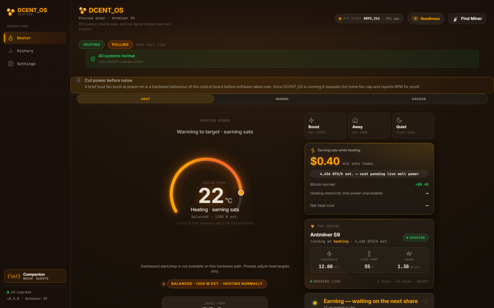
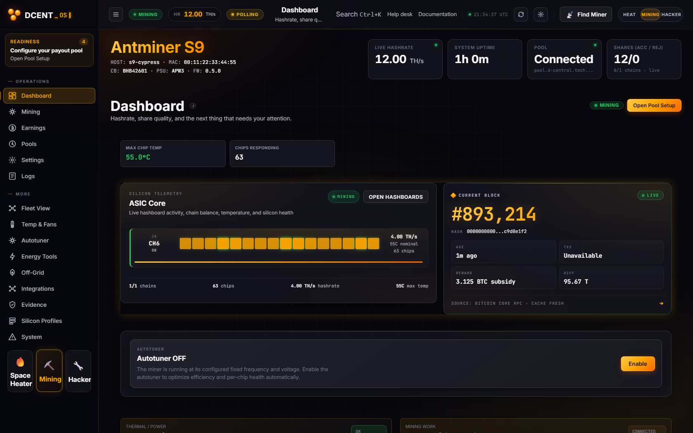

<div align="center">

# DCENT_OS — Open-Source Bitcoin Mining Firmware for Antminer & Bitaxe-Class Miners

**Turn an industrial Antminer or a desktop Bitaxe into a quiet, efficient, fully-owned Bitcoin
mining space heater — no cloud account, no telemetry, no license server, no mandatory dev fee.**

Rust mining daemon · Buildroot Linux & ESP32-S3 · local web dashboard · AI-native (built-in MCP server) · GPL-3.0

[](https://github.com/DCentralTech/DCENT_OS/actions/workflows/ci.yml)
[](LICENSE)


[](SECURITY.md)

[](https://d-central.tech/fund/)

_D-Central gives this away under GPL-3.0. If it helps you, [keep it alive](https://d-central.tech/fund/) — in Bitcoin or by card. Not a licence; commercial use is always free._

[Quick start](#quick-start) ·
[Screenshots](#see-it-running) ·
[Supported hardware](#one-firmware-family-many-miners) ·
[Test it yourself](TESTING.md) ·
[Security](SECURITY.md) ·
[Contributing](CONTRIBUTING.md)

</div>

---

Built by the **Mining Hackers** at [D-Central Technologies](https://d-central.tech/) — Canada's leading
Bitcoin mining technology company since 2016, based in Laval, Québec. 2,500+ miners repaired,
400+ products shipped. This is the firmware we run ourselves, released so every operator can own, repair,
and understand their own hardware.

**DCENT_OS** is home-mining firmware for two hardware classes: selected industrial **Bitmain
Antminers** (S9 → S21 era, Zynq / Amlogic / BeagleBone control boards) and **ESP32-S3 Bitaxe-class**
desk miners (BM1397 / BM1366 / BM1368 / BM1370). It replaces stock firmware with a modern **Rust
mining daemon**, a **local-first three-mode dashboard**, a **per-chip autotuner**, **Stratum V1 + V2**,
and a built-in **MCP server** so a local AI agent can monitor — and, with owner authentication,
control — the miner.

> **Decentralize every layer.** Heat your home. Stack sats.

## See it running

**Space Heater mode** — a thermostat, not a spreadsheet. Room temperature, BTU/h output, and an
honest "earning sats while heating" ledger. Quiet-first: DCENT_OS cuts hash power before it ever
raises fan noise.



**Mining mode** — live hashrate, silicon telemetry down to individual chips, current-block hero,
share quality, and pool state. Every number is evidence-gated: *connected ≠ mining, scheduled ≠
flashed, upload ≠ mined*.



**The Companion** — one of the first miner firmwares with an AI-native control surface. Point it at
a local LLM (LM Studio / Ollama — your model, your machine, no cloud), ask *"my miner is noisy,
what can we do?"*, and it proposes a guarded action you explicitly approve:

<p align="center"></p>

**The autotuner** — tune by what you actually care about: power, hashrate, fan noise, heat output,
or efficiency (J/TH), with an honest before → after prediction and hard safety clamps.


## One firmware family, many miners

```
DCENT_OS/
└── firmware/
    ├── antminer/     → industrial Antminers (S9 → S21): Rust dcentrald daemon + Buildroot Linux + dashboard + docs/
    ├── esp/          → ESP32-S3 Bitaxe-class miners (BM1397/1366/1368/1370): original Rust firmware + MCP
    ├── avalon/       → Avalon (Canaan) support — in development (see DCENT_OS_AvalonMiner/README.md)
    └── whatsminer/   → WhatsMiner (MicroBT) support — in development (see DCENT_OS_WhatsMiner/README.md)
```

| Platform | Where | Status |
|---|---|---|
| **Antminer** S9 / S17 / S19 / S19 Pro / S19j Pro / S21 | `DCENT_OS_Antminer/` | **Supported** — **mining achieved on multiple models** (accepted pool shares on our bench); see the honest per-model matrix in [`DCENT_OS_Antminer/docs/PLATFORMS.md`](DCENT_OS_Antminer/docs/PLATFORMS.md) (mining achieved vs bring-up vs blocked, and which proofs are still untested on the latest binaries). |
| **Bitaxe-class** Max / Ultra / Supra / Gamma / Hex Ultra / Hex Supra (ESP32-S3) | `DCENT_OS_ESP/` | **Supported** — Gamma live-verified; others driver- and host-tested. Built-in MCP (AI-control) server. |
| **Avalon** (Canaan) | `DCENT_OS_AvalonMiner/` | **In development** — architecture scaffolded; no mining claim yet. |
| **WhatsMiner** (MicroBT) | `DCENT_OS_WhatsMiner/` | **In development** — reverse engineering + bring-up underway; no mining claim yet. |

We publish an **honest readiness taxonomy**: *mining achieved* means accepted pool shares on real
hardware on our bench — nothing weaker earns the label, and where a proof hasn't been re-run on the
latest binaries the matrix says so instead of silently re-claiming it. Published live-capture
evidence has operator IP/MAC addresses rewritten to RFC 5737 documentation values as a privacy
measure; the captures come from real bench hardware.

## Quick start

Pick your platform and follow its guide:

- **Antminer:** [`DCENT_OS_Antminer/README.md`](DCENT_OS_Antminer/README.md) → flash a prebuilt signed
  release with [DCENT_Toolbox](https://github.com/DCentralTech/DCENT_Toolbox), or build the signed
  sysupgrade in Docker (a full flashable image needs non-redistributable SoC boot components, which
  the Toolbox route sources from your own unit — see
  [`DCENT_OS_Antminer/DEVELOPMENT.md`](DCENT_OS_Antminer/DEVELOPMENT.md)).
- **Bitaxe-class (ESP32):** [`DCENT_OS_ESP/README.md`](DCENT_OS_ESP/README.md) → build with the esp-rs
  toolchain and flash over USB or OTA.
- **Just want to try it?** [`TESTING.md`](TESTING.md) walks you from **zero-hardware** (run the test
  suite, drive the full dashboard with mock telemetry) through a **reversible `/tmp` trial** on a
  real Antminer to a persistent install — with an undo path at every tier.

## What makes DCENT_OS different

- **No mandatory dev fee.** A transparent, fully-disableable voluntary donation (zero is valid),
  always visible on the dashboard when active — versus the industry's forced 1.5–2.8%.
- **Quiet by default.** Low-PWM boot, PID thermal control, and a hard policy that **cuts hash power
  before raising fan noise** — firmware designed for the room you live in, not a warehouse.
- **Original open code.** GPL-3.0, no forked proprietary code. Every ASIC constant is documented
  with its source (live probe, datasheet, or our own reverse engineering), and open-source lineage
  (ESP-Miner, cgminer, BraiinsOS components) is attributed in
  [`THIRD_PARTY_NOTICES.md`](THIRD_PARTY_NOTICES.md).
- **Local-first.** Web dashboard, REST + WebSocket APIs, CGMiner-compatible API (port 4028,
  `pyasic`/Home-Assistant friendly), and MCP — all on your LAN. No cloud, no account, no phone-home.
- **AI-native.** Built-in MCP (Model Context Protocol) server: read-only monitoring for any agent,
  authenticated owner sessions for control. The dashboard Companion speaks to your own local LLM.
- **Real autotuning.** Closed-loop per-chip frequency/voltage search with measured feedback,
  PVT clamps, ramp limits, and rollback — opt-in, efficiency-first.
- **Stratum V1 + V2.** Multi-pool failover with anti-flap failback on V1; a native Stratum V2 stack
  (Noise encryption, certificate auth, job declaration) under an explicit readiness gate.
- **Safety-first engineering.** EEPROM write-protection at the HAL, fail-closed signed OTA with
  mandatory backup and dry-run-first, management-only first boot (a fresh flash never
  surprise-starts a loud miner), and thermal supervision with graded response.
- **Honest by design.** The UI and docs keep every claim evidence-gated — upload ≠ mined,
  scheduled ≠ flashed, connected ≠ mining.

## Test it yourself

You can verify almost everything in this repo without owning a miner — and everything with one.
Start with [`TESTING.md`](TESTING.md):

1. **Tier 0 (no hardware):** `cargo test` the daemon workspace; run the dashboard against the
   bundled mock-telemetry server; cross-compile the real ARM binary.
2. **Tier 1 (a $100-class Bitaxe):** flash over USB, fully reversible.
3. **Tier 2 (an Antminer, zero persistent writes):** run `dcentrald` from `/tmp` over SSH — a
   reboot restores the incumbent firmware untouched.
4. **Tier 3 (persistent):** signed packages through DCENT_Toolbox with backup-first, dry-run-first
   safety gates.

Community test reports — success or failure — are how bring-up models get promoted. Use the
platform-bring-up issue template.

## The D-Central open-source Bitcoin mining ecosystem

All under one roof at **[github.com/DCentralTech](https://github.com/DCentralTech)** — decentralize every
layer: mining, tools, hardware, communication.

- **[DCENT_OS](https://github.com/DCentralTech/DCENT_OS)** — this repo: open-source mining firmware for
  industrial Antminers and ESP32 Bitaxe-class miners (Avalon + WhatsMiner scaffolded).
- **[DCENT_Toolbox](https://github.com/DCentralTech/DCENT_Toolbox)** — the open-source bench tool: scan,
  unlock, audit, flash, and prove — from your own machine.
- **[DCENT_axe](https://github.com/DCentralTech/DCENT_axe)** — open-hardware Bitaxe-class boards
  (Solo / Quad / Hex) with integrated LoRa mesh.
- **[DCENT_Raven](https://github.com/DCentralTech/DCENT_Raven)** — LoRa-mesh accessory for any Bitaxe.

## Support / Fund D-Central

DCENT_OS and the whole ecosystem are free and open under GPL-3.0 — no license server, no mandatory
dev fee. If it helps you, help keep the lights on: **[d-central.tech/fund](https://d-central.tech/fund/)**
(Bitcoin ⚡ or card). Funding pays for the reverse engineering, firmware, and open-hardware work that
makes the sovereign mining stack possible. Commercial use is always free — this is a thank-you, not a toll.

## License, security & governance

GPL-3.0 — the [`LICENSE`](LICENSE) file is the verbatim license text; copyright and third-party
attribution live in [`THIRD_PARTY_NOTICES.md`](THIRD_PARTY_NOTICES.md). Vulnerabilities: see
[`SECURITY.md`](SECURITY.md) (coordinated disclosure, safe harbor). Contributions welcome — see
[`CONTRIBUTING.md`](CONTRIBUTING.md), [`GOVERNANCE.md`](GOVERNANCE.md), and
[`CODE_OF_CONDUCT.md`](CODE_OF_CONDUCT.md). DCENT_OS is steered by D-Central Technologies and built
in the open for the whole mining community.
